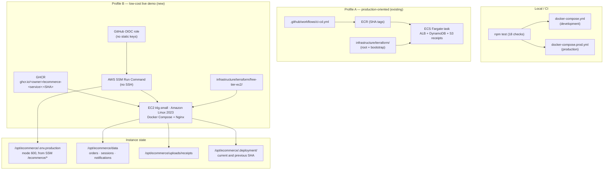

# Deployment summary — low-cost AWS live demo profile

> **Branch:** `feat/vodafone-cash-manual-payment`
> **Goal:** make this repository deployable to a real AWS account as an
> inexpensive, honest live demo — without disturbing the existing
> ECS / Kubernetes / Terraform / Jenkins / monitoring work.

---

## 1. Scope and explicit non-actions

**Done in this change set:** local code, infrastructure, scripts, workflow and
documentation only.

**Deliberately *not* done:**

- No `terraform apply`, no `terraform destroy`, no `terraform plan` against real
  credentials.
- No AWS resource of any kind was created. No AWS CLI was even available in
  this environment.
- No `git push`, and nothing was committed to `main`. All changes are local.
- No secret value was printed, written to a file inside the repository, or
  committed. Files that would hold secrets (`.env.production`) are git-ignored.
- No SSH key, no inbound port 22, no static AWS access key anywhere.
- No weakening of Helmet, CSP, CSRF, rate limiting, `HttpOnly`/`SameSite`
  cookies, timing-safe comparison, token hashing, or non-root containers.

Everything below is classified honestly as **verified locally**,
**statically validated**, or **requires AWS / DNS / GitHub configuration**.

---

## 2. Repository verification

| Check | Result |
| --- | --- |
| Working repository | `ecommerce-deploy-unified-local-ready` (sibling of the template folder) |
| Template folder `Automated-E-Commerce-Deployment-Platform-main/` | **Untouched** — no file was created, edited or deleted there |
| Branch before work | `feat/vodafone-cash-manual-payment`, clean tree |
| Baseline before work | `npm test` 14/14 · `terraform fmt -check -recursive` clean · both existing modules `validate` OK · `docker compose config --quiet` OK |

---

## 3. Two deployment profiles



Profile A is untouched apart from two incidental fixes listed in §5 and §7.
Profile B is entirely additive.

**The stack (both profiles):** seven Node.js services — frontend, API gateway,
backend, product, cart, search, demo payment — plus Nginx as the only published
entry point.

---

## 4. Free-tier EC2 Terraform profile

New directory: `infrastructure/terraform/free-tier-ec2/`

| File | Contents |
| --- | --- |
| `versions.tf`, `providers.tf` | Terraform `>= 1.5`, AWS provider `~> 5.0`, required tags |
| `variables.tf` | 15 variables with validation; budget variables default **off** |
| `networking.tf` | 1 VPC · 1 public subnet · 1 IGW · 1 route table — **no NAT** |
| `security.tf` | Security group allowing **80/443 only**, **no port 22** |
| `iam.tf` | Instance role: `AmazonSSMManagedInstanceCore` + read-only `/ecommerce/*`; optional budget + SNS (`count = 0` by default) |
| `ec2.tf` | `t4g.small` (ARM64), IMDSv2 required (`http_tokens = required`), encrypted **gp3 20 GB** root, AL2023 ARM64 AMI from SSM |
| `user-data.sh` | Installs Docker CE + Compose v2 plugin, `jq`, AWS CLI, enables `amazon-ssm-agent`, adds `ssm-user` to the `docker` group, adds `ecommerce-health`/`ec-status`/`ec-logs` helpers |
| `outputs.tf` | `instance_id`, `public_ip`, `application_http_url`, SSM run/teardown instructions |
| `terraform.tfvars.example` | Safe, documented defaults |
| `README.md` | Profile-specific walkthrough |

**Least destructive choice:** the existing `infrastructure/terraform/` layout
was left exactly where it was. `free-tier-ec2/` sits alongside `bootstrap/` as a
third, independent module — nothing was moved, renamed or re-pointed.

**IAM:** no `PowerUserAccess`, no wildcard. The instance can only manage its own
SSM session and read `ssm:GetParametersByPath` under `/ecommerce/*`.

**Terraform hygiene — all verified locally:**

```text
terraform fmt -check -recursive     -> clean (root, bootstrap, free-tier-ec2)
terraform init -backend=false       -> Success (all three)
terraform validate                  -> Success, no warnings (all three)
```

One pre-existing warning in `infrastructure/terraform/main.tf` was fixed by
adding the required `filter {}` block to `aws_s3_bucket_lifecycle_configuration.receipts`.

---

## 5. Production Nginx configuration

New files:

```text
nginx/production.conf              main config: events/http, hardened, includes conf.d/
nginx/conf.d/00-default.conf       the single HTTP server block (ports 80/443)
nginx/snippets/proxy-common.conf   shared proxy headers (HTTP and HTTPS stay identical)
nginx/https.conf.tpl               TLS server block template, rendered by setup-https.sh
```

Behaviour:

- `location /` → frontend; `location /api/` → **API gateway (`api:4600`)** via
  Docker DNS (never a hard-coded IP).
- Reverse proxy headers, `X-Forwarded-For`/`Proto`/`Host`, WebSocket upgrade
  headers, sane connect/send/read timeouts.
- `server_tokens off`; server header removed; error pages never leak upstream
  stack traces (`proxy_intercept_errors` + named `@api_unavailable` fallback).
- Request limits: body size capped at the receipt upload limit, header/request
  rate controls, `limit_except GET HEAD POST DELETE OPTIONS` on `/api/`.
- Security headers: HSTS (TLS block only), `X-Content-Type-Options`,
  `X-Frame-Options`, `Referrer-Policy`, `Permissions-Policy`, `X-Robots-Tag`.
- `/nginx-health` liveness endpoint; ACME webroot for HTTP-01;
  `stub_status` at `/nginx_status` restricted to private ranges.
- Published ports: **80 and 443 only**.

**Verified locally:** `nginx -t` passes against a real `nginx:1.27-alpine`
container (run with `--add-host frontend:127.0.0.1 --add-host api:127.0.0.1`
when tested outside Compose). Invalid directives found during authoring
(`more_clear_headers`, a malformed `proxy_cache_valid`) were removed.

---

## 6. API routing and regression tests

**The bug:** on a real deployment the storefront's health check returned 200
while checkout and the owner dashboard returned **404** — traffic was reaching
the frontend container instead of the API gateway.

**The fix** (`services/api/src/index.js`):

- CORS now derives from `PUBLIC_BASE_URL` and **fails closed**
  (`done(new Error('Origin is not allowed'))`) instead of `origin: true`. The
  same pattern is used by the payment service. Grep confirms no
  `origin: process.env.PUBLIC_BASE_URL || true` remains anywhere.
- `SERVICES.frontend` added so the gateway can serve frontend-owned config.
- Two latent 404s found and fixed while writing the tests:
  - `/api/contact` fell through to the backend (which has no such route).
  - `/api/categories` fell through to the backend (which has no such route),
    even though the product service exposes `/categories`.

**Regression tests added** (`tests/services.test.js`, 14 → 18 tests):

1. *gateway routes every required public path to the right service* — asserts
   the routing table for `health`, `products`, `products/:id`, `categories`,
   `search`, `cart`, `payments/*`, `admin/*`, `orders`, `contact`.
2. *nginx production config proxies `/api/` to the gateway using Docker DNS* —
   parses the real config files; fails if `/api/` ever points at the frontend or
   if an upstream uses a literal IP.
3. *public contact section is mailto based and exposes no phone by default*.
4. *payment store round-trips orders across a simulated restart* (§7).

These catch the failure class without needing Docker or AWS.

---

## 7. Data persistence across restarts

**Choice:** the smallest solution that survives `docker compose down/up` — a
file-backed JSON adapter reusing the project's existing `PERSISTENCE_DRIVER`
convention. No RDS, no SQLite, no native/binary npm modules (which keeps the
ARM64 image build trivial).

New `services/payment/src/store.js`:

- `PERSISTENCE_DRIVER=local` **and** `DATA_DIR` set → atomic JSON file
  (`write temp → rename`), mode `0600`, directory mode `0750`.
- `PERSISTENCE_DRIVER=memory` or `DATA_DIR` unset → previous in-memory
  behaviour. **Persistence is opt-in**, which keeps the test suite side-effect
  free.
- Debounced writes (1 s) plus a final flush on `SIGTERM`/`SIGINT`, so a normal
  `docker compose stop` never loses data.
- Corrupt files are **quarantined** (`*.corrupt-<ts>`), never deleted, never
  crash the service.
- Expired owner sessions are pruned on restore instead of being resurrected.
- Fail-soft: an unwritable directory (e.g. root-owned bind mount) disables
  persistence and runs in memory rather than taking the service down.
- Rate-limit counters are **deliberately not persisted** — resetting them on
  restart is the safe direction.

**What is persisted:** orders (status, items, customer, audit log), owner
sessions, notification index, payment status, receipt metadata (key, content
type, timestamps). Receipt *bytes* live under `uploads/receipts/`.

**Host paths (production):**

```text
/opt/ecommerce/data/payment-store.json
/opt/ecommerce/uploads/receipts/<40-hex>.<ext>
```

**Verified locally — full end-to-end:**

```text
1. POST /api/payments/orders                      -> 201, orderId issued
2. host file ./data/payment-store.json            -> 970 bytes, contains orderId
3. docker compose restart payment                 -> "Payment store restored: 1 orders"
4. docker compose down                            -> 0 containers
5. docker compose up -d                           -> "Payment store restored: 2 orders, 0 sessions, 3 notifications"
6. both orders reachable (200) after full down/up -> PASS
   (one of them in status receipt_submitted, with its receipt file still on disk)
```

Receipt upload also verified: a valid PNG was accepted, stored on the host under
a random 40-hex filename, and its status survived the full `down`/`up`.

**Single-instance limitation (documented, not hidden):** the adapter mirrors
in-memory `Map`s to **one** file. Two payment containers would clobber each
other. This is acceptable because the profile is explicitly one `t4g.small`
running one Compose project. Scaling horizontally requires moving to a real
datastore — the code is isolated behind `store.js`, so the swap is local.

---

## 8. Receipt storage without S3

- `RECEIPTS_STORAGE_DRIVER=local` in `docker-compose.prod.yml`; the S3 adapter
  and its IAM/`RECEIPTS_BUCKET` path are **kept in the code** for a future
  profile — nothing was deleted.
- File validation (magic bytes, extension allow-list, size cap), random
  filenames, and "no public exposure" are unchanged: receipts are served only
  through the authenticated `GET /api/admin/orders/:id/receipt` route with
  `Cache-Control: private, no-store` and `Content-Disposition: inline`.
- `services/payment/Dockerfile` now creates and chowns `/app/data` and
  `/app/uploads/receipts` so the non-root `node` user can write to both bind
  mounts.
- Dev and prod compose now agree on `RECEIPTS_LOCAL_PATH=/app/uploads/receipts`.

---

## 9. Secrets: SSM Parameter Store → `/opt/ecommerce/.env.production`

```text
AWS SSM Parameter Store  (/ecommerce/*)
        │  aws ssm get-parameters-by-path --recursive --with-decryption (paginated)
        ▼
scripts/aws/load-ssm-env.sh
        │  umask 077 · mktemp in the target directory · chmod 600 · atomic mv
        ▼
/opt/ecommerce/.env.production   (mode 600, never committed, never logged)
        │  docker compose env_file → payment container only
        ▼
```

- **Values are never printed.** Not with `--list` (names only), not with
  `set -x`, not in any log line.
- Key mapping: `/ecommerce/public-base-url` → `PUBLIC_BASE_URL`.
- Recommended keys are checked and a **name-only** warning is emitted when one
  is missing; it never prints what *is* set.
- `docker-compose.prod.yml` attaches the file to the payment service via
  `env_file: { path: ${APP_ENV_FILE}, required: false }` — no secret is inlined
  into the Compose file, and the stack still validates without the file.

---

## 10. Contact section

`services/frontend/public/index.html` gains a `<section id="contact">` between
`</main>` and the footer (the footer id moved to `site-footer`, so the nav's
"تواصل معنا" link now scrolls to the real contact section).

- Copy (required verbatim): **"Have a question or want to connect?"** and the
  button **"Contact Me"** — both present in the English dictionary; the Arabic
  equivalents are present too (the storefront is bilingual).
- Primary action is a plain `mailto:mostafaahmed862004@gmail.com` link, repeated
  as visible text. The pre-existing LinkedIn and GitHub footer links are kept.
- `GET /api/contact` (`services/frontend/server.js`) returns
  `{ email, phone }`. `PUBLIC_CONTACT_PHONE` is **unset by default**, so the
  `#contactPhone` anchor stays `hidden` and no number is rendered. When set, the
  client reveals it as a `tel:` link.
- **No backend form, no database, no CAPTCHA, no SaaS, no contact model.**
- The section works with JavaScript disabled (the mailto link is static HTML).
- Regression test asserts: section present, mailto present, `href="tel:"`
  absent by default, endpoint returns `phone: ""`.

---

## 11. Production Docker Compose stack

New `docker-compose.prod.yml`:

- `x-service-defaults` anchor: `restart: unless-stopped`, internal `app-net`
  only, `security_opt: no-new-privileges:true`, per-service memory limits
  (192 MB app / 48 MB sidecar), `json-file` log rotation (`10m`, 3 files).
- Eight core services: `nginx` (the only one publishing **80/443**), `frontend`,
  `api`, `backend`, `product`, `cart`, `search`, `payment`.
- Every service has a healthcheck; `depends_on: condition: service_healthy`
  drives startup order.
- `NODE_ENV=production` everywhere; payment state bind-mounted to
  `${DATA_DIR_HOST}` / `${RECEIPTS_DIR_HOST}` (default `./data`,
  `./uploads/receipts`).
- Both `image:` (GHCR, `IMAGE_TAG`) **and** `build:` are present, so the file
  can be built locally *and* pulled on the host.
- `env_file` for secrets with `required: false`.
- `--profile monitoring` adds Prometheus, Grafana and the nginx exporter.

**Verified locally:** `docker compose -f docker-compose.prod.yml config --quiet`
passes, and `--profile monitoring config --services` lists all 11 services.

---

## 12. HTTPS as a documented second stage

`scripts/aws/setup-https.sh example.com admin@example.com [--staging] [--force] [--skip-dns]`

1. Validates the FQDN and email; refuses anything malformed.
2. Compares DNS with the instance's public IPv4 (IMDSv2 token, fallback to
   `checkip.amazonaws.com`) — **warning only**, never a hard stop.
3. Issues the certificate with the `certbot/certbot` container using
   **HTTP-01 webroot** (no extra ports, app containers uninvolved).
4. Renders `nginx/https.conf.tpl` → `nginx/conf.d/443-ssl.conf`.
5. Runs `nginx -t` **before** reloading; if it fails the new file is removed and
   the site keeps serving HTTP. A broken certificate attempt cannot take the
   site down.
6. Installs a twice-daily renewal job (03:17 / 15:17) that reloads nginx **only
   when the certificate actually changed**.

**HTTP keeps working without a domain** — this script is never required.
`deploy.sh` explicitly preserves an existing `443-ssl.conf` across config
refreshes so a redeploy cannot silently drop the certificate.

> The owner dashboard sets a `Secure` session cookie in production, so admin
> login becomes fully functional **only after** HTTPS is enabled. This is called
> out in the script output and here rather than papered over.

**Requires DNS.** Not verifiable in this environment.

---

## 13. GitHub Actions workflow

New `.github/workflows/deploy-free-tier.yml`. `ci-cd.yml` for the legacy ECS
profile is preserved in full but is now **manual only** (see the gate note
below):

| Stage | Trigger | Notes |
| --- | --- | --- |
| `validate` | every PR **and** push | `npm ci` · `npm test` · `node --check` over all JS · `bash -n` over all shell · `terraform fmt -check -recursive` · `init -backend=false` + `validate` for **all three** modules · `docker compose config` for both files · `nginx -t` |
| `build-pr` | after `validate`, **pull requests only** | QEMU + Buildx, **`platforms: linux/amd64,linux/arm64`**, matrix of the 7 services, **`push: false`** — no GHCR login, no `packages: write`, no tag, so `:latest` can never move |
| `build-publish` | after `validate`, `refs/heads/main` **and** not a `pull_request` | same multi-arch matrix, logs in to GHCR and pushes `ghcr.io/<owner>/ecommerce-<service>:<GITHUB_SHA>` **and** `:latest`, GHA layer cache |
| `deploy` | **all three**: `github.ref == 'refs/heads/main'`, `github.event_name != 'pull_request'`, `vars.ENABLE_FREE_TIER_DEPLOY == 'true'` | GitHub **OIDC** → `aws-actions/configure-aws-credentials` → **SSM Run Command** → poll → public smoke tests |

- `permissions:` top level is `contents: read`. **Only `build-publish` adds
  `packages: write`, and only the deploy job adds `id-token: write`** (required
  for OIDC). `build-pr` runs with `contents: read` alone, so a pull request can
  never obtain publish or AWS permissions.
- **`ENABLE_FREE_TIER_DEPLOY` gates the AWS deployment.** It is a repository
  *variable*, not a secret. Unset — the current state — or any value other than
  the exact string `true` keeps the `deploy via SSM` job **skipped**; only `true`
  permits the SSM deploy on `main`. Validation and image builds still run either
  way.
- **Pull requests never publish.** `build-pr` uses `push: false`, performs no
  GHCR login and declares no tag at all, so PR code cannot create packages or
  move `:latest`.
- `workflow_dispatch` is allowed but the `if:` guard refuses any ref other than
  `refs/heads/main`, and a second explicit guard inside the job re-checks it.
- **No static AWS keys anywhere.** `GITHUB_TOKEN` is only used for GHCR.
- Image owner is lowercased (`${GITHUB_REPOSITORY_OWNER,,}`) because GHCR
  requires it.
- The SSM command string is built in `bash`, serialised with `jq` into a
  `file://` parameters document, and contains **no secret** — only the SHA,
  the repository name and non-secret ports.

**Legacy ECS profile (`ci-cd.yml`) is manual only.** `provision-registry`,
`build` and `deploy` all carry exactly this condition:

```yaml
if: github.event_name == 'workflow_dispatch' && github.ref == 'refs/heads/main' && inputs.deploy_legacy_ecs == true
```

The workflow gained a `workflow_dispatch` boolean input `deploy_legacy_ecs`
(`required: true`, `default: false`). `validate` still runs on every pull
request and on every push to `main`, so an ordinary merge **cannot** provision
ECR, push ECR images, run `terraform apply` or deploy to ECS. The legacy
ECS/ECR code and its two `terraform apply` steps are retained unchanged for
portfolio/reference purposes, behind that single manual gate.

---

## 14. Required GitHub settings

| Kind | Name | Required | Purpose |
| --- | --- | --- | --- |
| **Secret** | `AWS_FREE_TIER_ROLE_ARN` | yes | Least-privilege role **this** workflow assumes via GitHub OIDC (bootstrap output `free_tier_role_arn`) |
| **Secret** | `AWS_LEGACY_ROLE_ARN` | legacy profile only | Broad role used **only** by `ci-cd.yml`'s manual ECS jobs (bootstrap output `legacy_role_arn`) |
| **Variable** | `AWS_REGION` | yes | Region for `configure-aws-credentials` |
| **Variable** | `AWS_INSTANCE_ID` | yes | `--instance-id` for SSM Run Command |
| **Variable** | `APP_URL` | recommended | Base URL for the post-deploy public smoke test |
| **Variable** | `ENABLE_FREE_TIER_DEPLOY` | **yes, to deploy** | `true` permits the SSM deploy job; unset or `false` skips it. **Not configured yet.** |
| `GITHUB_TOKEN` | automatic | — | GHCR push (write permission on `build-publish` only) |

**`ENABLE_FREE_TIER_DEPLOY` is the deployment gate and it fails closed.**
`vars.ENABLE_FREE_TIER_DEPLOY` evaluates to an empty string when the repository
variable does not exist, so today — before AWS is configured — the `deploy via
SSM` job is **SKIPPED**:

| Value | Validation / build | AWS SSM deployment |
| --- | --- | --- |
| unset (current), `false`, or anything but `true` | runs | **skipped** |
| `true` | runs | permitted on `refs/heads/main` |

**The two profiles use different roles and never share one.**

| Profile | Workflow | Secret | Role | Grant |
| --- | --- | --- | --- | --- |
| B — free-tier | `deploy-free-tier.yml` | `AWS_FREE_TIER_ROLE_ARN` | `<project>-github-actions-free-tier` | `ssm:SendCommand` on `AWS-RunShellScript` + one instance, and `ssm:GetCommandInvocation` |
| A — legacy ECS | `ci-cd.yml` | `AWS_LEGACY_ROLE_ARN` | `<project>-github-actions-legacy` | AWS `PowerUserAccess` + IAM on `<project>-*` roles |

`PowerUserAccess`, `AdministratorAccess`, `iam:*`, `ec2:*`, `s3:*` and `ssm:*`
are **not** granted to the free-tier role. The only wildcard is
`Resource: "*"` on `ssm:GetCommandInvocation`, which AWS does not expose with a
resource type, so it cannot be narrowed — see
`infrastructure/terraform/bootstrap/main.tf` for the full reasoning. Both roles
share one account-level OIDC provider and the same trust conditions:
`repo:mostafaahmed-eng/ecommerce-deploy` + `ref:refs/heads/main` +
audience `sts.amazonaws.com`, so a `pull_request` run can assume neither.

**`TF_STATE_BUCKET` is not used by this workflow.** The new profile keeps
Terraform state local by default, so the variable is unnecessary — but the
existing `ci-cd.yml` / bootstrap backend configuration was left intact, so the
ECS profile's remote-state support still works exactly as before.

**GHCR package visibility:** publishing as a **public** package is preferred
for a portfolio demo — anyone can then `docker pull` the images and the demo
works from any machine. If the repository or its packages are **private**, the
deploying host needs registry credentials: `docker login ghcr.io` with a
`read:packages` token before `deploy.sh` runs `docker compose pull`. The
workflow itself always authenticates for the *push*.

---

## 15. Deployment over SSM (no SSH)

New `scripts/aws/deploy.sh` (`set -euo pipefail`):

```text
--sha <GITHUB_SHA> --repo <owner>/<name> [--base-url URL] [--rollback]
        │
        ├─ 1. fetch pinned config for that exact SHA (compose + nginx + scripts)
        │     and preserve any existing conf.d/443-ssl.conf
        ├─ 2. write compose/.env  (IMAGE_TAG, GHCR_OWNER, ports, mount paths)
        ├─ 3. load-ssm-env.sh  → /opt/ecommerce/.env.production (600)
        ├─ 4. rotate release metadata  (previous = current, current = new)
        ├─ 5. docker compose pull
        ├─ 6. docker compose up -d --remove-orphans
        ├─ 7. wait for every container to become healthy (poll, 5 s × 40)
        └─ 8. smoke-test.sh  →  fail => diagnostics + automatic rollback
```

- Access is **only** through `aws ssm send-command` /
  `aws ssm start-session`. There is no port 22 and no key pair.
- `set -euo pipefail` throughout; `diagnostics()` prints `compose ps` plus the
  last 40 log lines of nginx/api/frontend/payment with
  `PASSWORD|SECRET|TOKEN|PASS=<redacted>` scrubbing — **non-secret diagnostics
  only**.
- Host directories are chowned to uid 1000 so the non-root containers can write.

**New `scripts/aws/load-ssm-env.sh`** — see §9.

---

## 16. Release metadata and rollback

```text
/opt/ecommerce/.deployment/current    the SHA that is (meant to be) running
/opt/ecommerce/.deployment/previous   the last known-good SHA — rollback target
```

Before every deploy: `previous = current`, `current = new SHA`.

If `docker compose pull`, `up`, the health wait, **or the smoke tests** fail:

1. `diagnostics()` runs (non-secret),
2. `IMAGE_TAG` is reverted to `previous`, `current` is set to `previous`,
3. `compose pull && up -d && wait`,
4. smoke tests are re-run against the rolled-back release,
5. the script still exits non-zero so the GitHub job is red.

Guard rails: rollback refuses to run when `previous` is empty, when
`previous == current`, or when `previous` equals the SHA that just failed — so
a known-bad release can never be re-applied by mistake. A successful rollback
leaves `current == previous`, which makes a second rollback a no-op refusal.

`--no-rollback` is available when the caller wants to own the decision.

**Requires AWS** to observe end to end.

---

## 17. Smoke tests

New `scripts/smoke-test.sh` — deliberately **credential-free**, so nothing
sensitive can ever appear in a GitHub Actions log.

```text
GET   /nginx-health              -> 200     nginx liveness
GET   /                          -> 200     storefront
GET   /styles.css                -> 200     static assets
GET   /api/health                -> 200     gateway -> backend
GET   /api/products              -> 200     gateway -> product
GET   /api/search?q=phone        -> 200     gateway -> search
GET   /api/categories            -> 200     gateway -> product categories
GET   /api/cart/smoke-test-user  -> 200     gateway -> cart
GET   /api/payments/config       -> 200     gateway -> payment
POST  /api/payments/orders       -> 400     payment order route exists
GET   /api/admin/session         -> 401     admin route exists and is guarded
GET   /api/admin/orders          -> 401     admin list guarded
GET   /api/contact               -> 200     public contact config
```

- **400/401 are PASS** — they prove the route exists, is reached, and is
  correctly validated/guarded.
- **404, 502, 503 are always FAIL**, even if somehow listed as acceptable.
- `--verbose` prints the first lines of a failing body for triage.

**Verified locally:** all 13 checks pass against the full production stack
running in Docker (`docker compose -f docker-compose.prod.yml up -d`).

---

## 18. Optional monitoring profile

Prometheus, Grafana and `nginx/nginx-prometheus-exporter` are behind
`--profile monitoring` — **off by default**.

- Separate `monitoring/prometheus/prometheus.compose.yml` (30 s interval,
  6 h / 128 MB retention) so the existing Kubernetes `prometheus.yml` is
  untouched.
- Scrapes Prometheus itself, the nginx exporter, and Grafana.
- Exporter reads `stub_status` from `nginx/nginx_status`, which is restricted to
  private ranges.
- **2 GiB caveat:** the seven app services plus Nginx are capped at roughly
  1.4 GiB of memory limits. Turning on all three monitoring containers on a
  `t4g.small` is possible but leaves little headroom — run it for a demo, not
  permanently. Documented in `DEPLOYMENT_SUMMARY` and the profile README.

**Verified locally:** `docker compose -f docker-compose.prod.yml --profile
monitoring up -d` → all 11 containers up; Prometheus reported
`nginx-exporter` and `prometheus` **health: up**, Grafana `/metrics` responded,
and `nginx_http_requests_total` was queryable.

---

## 19. Security posture — nothing weakened

| Control | Status |
| --- | --- |
| Helmet + CSP | Unchanged |
| CSRF double-submit token on admin routes | Unchanged |
| Login rate limiting (5 / 15 min) and per-route order/receipt limits | Unchanged |
| `HttpOnly`, `SameSite=Strict`, `Secure` session cookie | Unchanged |
| Timing-safe comparison + SHA-256 hashed tracking tokens | Unchanged |
| Non-root containers | Unchanged (`USER node`) |
| **CORS** | **Hardened** — derived from `PUBLIC_BASE_URL`, fails closed with `done(new Error('Origin is not allowed'))`. No `origin: true` anywhere. |
| Inbound ports | **80/443 only**; no SSH; SSM instead |
| IMDSv2 | Required (`http_tokens = required`) |
| Secrets | SSM Parameter Store, `chmod 600` on the host, git-ignored, never logged |
| EBS root volume | Encrypted, gp3 |
| Nginx | `server_tokens off`, upstream error pages intercepted, request/header limits |

**CORS operational note:** because CORS is now fail-closed, `PUBLIC_BASE_URL`
must exactly equal the browser origin (e.g. `http://localhost:8080` locally,
`http://<instance-dns>` for plain HTTP). A mismatch shows up as a 500 on
cross-origin API calls — this is intended behaviour and is documented rather
than hidden behind `origin: true`.

---

## 20. Dependency audit, secret hygiene and `.gitignore`

**`npm audit` — before → after:**

```text
before: 4 vulnerabilities (1 high, 3 moderate)
        nodemailer <= 9.1.0        high
        express 4.22.2 / body-parser 1.20.5-1.20.6 / qs 6.2.5-6.15.3   moderate
after:  found 0 vulnerabilities     (npm audit  and  npm audit --omit=dev)
```

- The three moderate issues were fixed with a non-breaking `npm audit fix`
  (express 4.22.2 → 4.22.3, qs → 6.16.0, body-parser → 1.20.8).
- `nodemailer` was bumped **explicitly** to `^10.0.10` (a major version), not
  via `audit fix --force`. The call sites only use `createTransport()` and
  `sendMail()`, both unchanged in v10, and `npm test` was re-run afterwards.
  This was the only breaking-change bump and it was deliberate.
- **All seven per-service `package-lock.json` files were regenerated**, because
  Docker's `npm ci` uses those, not the workspace root lock. Drift was small and
  forward-moving (5 packages in payment, ~4 elsewhere).

**`.gitignore` now covers:** `.env`, `.env.*`, `*.log`, `*.tfstate`,
`*.tfstate.*`, `*.tfplan`, `*.tfvars`, `.terraform/`, `*.pem`, `*.key`,
`*.crt`/`*.p12`/`*.pfx`, `data/`, `uploads/`, `certbot-www/`, `letsencrypt/`,
`.deployment/`, `node_modules/`.

**Verified locally:** `git check-ignore` confirms `.env`, `.env.production`,
`data/*`, `uploads/*`, `terraform.tfstate`, `*.tfplan`, `*.tfvars`, `*.pem`,
`*.key` are all ignored; `.env.example` and `*.tfvars.example` remain tracked
(`git ls-files --error-unmatch .env.example` succeeds).

**`.env.example`** was corrected (`PUBLIC_BASE_URL` 8088 → 8080 to match the
compose default) and now documents `DATA_DIR`, `PERSISTENCE_DRIVER`,
`RECEIPTS_STORAGE_DRIVER`, `RECEIPTS_LOCAL_PATH` and the optional
`PUBLIC_CONTACT_PHONE`, with the exact commands to generate
`ADMIN_PASSWORD_HASH` and `ADMIN_SESSION_SECRET`.

---

## 21. Cost safety and free-tier caveats

Full treatment in [`docs/AWS_FREE_TIER_DEPLOYMENT.md`](docs/AWS_FREE_TIER_DEPLOYMENT.md).

**Headline — current situation:** *no $0 outcome is guaranteed*, but the compute
**is** covered right now. At the time this deployment profile was prepared, AWS
provides a **T4g free trial** covering up to **750 aggregate instance-hours per
month of `t4g.small`**, available to new and existing AWS customers, through
**December 31, 2026**. Regular On-Demand billing starts **January 1, 2027**.

Other resources, surplus CPU credits, network usage, storage, public IPv4 usage
outside applicable allowances, and usage after the trial may incur charges.
Eligibility and AWS terms can change.

Current trial-period expectation (24/7 in `us-east-1`):

```text
EC2 t4g.small (trial)   $0        <= 750 hrs/mo, through Dec 31 2026
gp3 20 GB               ≈ $1.60 / month   (subject to EBS allowances)
Public IPv4 (auto)      ≈ $3.65 / month   (subject to applicable allowances)
                        -----------------
                        ≈ $5.25 / month, excluding trial-covered compute
```

Expected On-Demand cost **from January 1, 2027**, with no trial and no
allowances applied:

```text
EC2 t4g.small       ≈ $12.00 / month
gp3 20 GB           ≈  $1.60 / month
Public IPv4 (auto)  ≈  $3.65 / month
                      -----------------
                      ≈ $17.25 / month      (≈ $1.60/month if stopped)
```

The ≈ $17.25/month figure is the **post-trial 2027 On-Demand** number — it is
**not** the current expected bill while the T4g free trial applies.

**Cost traps explicitly avoided** (with figures): NAT Gateway (~$32+/mo), ALB
(~$16+/mo), ECS Fargate, EKS control plane (~$73/mo), RDS, Secrets Manager,
Route 53 zone, WAF, idle Elastic IP, CloudWatch Logs ingestion, ECR storage
(images go to GHCR), CodeBuild minutes.

**Guard rails shipped:**

- Pre-apply checklist in the cost doc (13 items).
- Budget + SNS alert: **CLI commands** *and* **optional Terraform**
  (`create_budget` defaults to `false`, so a plain `plan` creates no
  account-level resources).
- `aws ce get-cost-and-usage` and "what is still running" one-liners.
- Teardown procedure and an explicit warning that destroying the instance
  destroys `/opt/ecommerce/data` and `/opt/ecommerce/uploads/receipts`.

---

## 22. Documentation, validation and honest verification status

### Documentation added/updated

- **`DEPLOYMENT_SUMMARY.md`** — this file (22 sections).
- **`docs/AWS_FREE_TIER_DEPLOYMENT.md`** — cost model, caveats, pre-apply
  checklist, budget commands, Parameter Store layout, teardown.
- **`README.md`** — keeps *every* existing ECS / Kubernetes / Jenkins /
  Terraform / Prometheus / Grafana section, and adds: the two-profile overview
  with the Mermaid diagram, a full low-cost operations runbook (first apply →
  secrets → GitHub settings → deploy → rollback → HTTPS → teardown), the
  required GitHub settings table, and links to the two documents above.

### Validation matrix

| Check | Status |
| --- | --- |
| `npm test` — **18/18** | ✅ **Verified locally** |
| `node --check` on every `services/**` and `tests/**` JS file | ✅ **Verified locally** |
| `docker compose config --quiet` (dev) | ✅ **Verified locally** |
| `docker compose -f docker-compose.prod.yml config --quiet` | ✅ **Verified locally** |
| `docker compose ... --profile monitoring config --services` → 11 | ✅ **Verified locally** |
| All 7 service images build | ✅ **Verified locally** |
| Full production stack up, all containers healthy | ✅ **Verified locally** |
| 10 route checks through Nginx → gateway → service | ✅ **Verified locally** |
| `scripts/smoke-test.sh` — 13/13 | ✅ **Verified locally** |
| Persistence across `restart` **and** full `down`/`up` | ✅ **Verified locally** |
| `nginx -t` against a real `nginx:1.27-alpine` | ✅ **Verified locally** |
| `terraform fmt -check -recursive` (3 modules) | ✅ **Verified locally** |
| `terraform init -backend=false` + `validate` (3 modules) | ✅ **Verified locally** |
| Both workflow YAML files parse | ✅ **Statically validated** |
| `bash -n` on all 5 shell scripts | ✅ **Statically validated** |
| `npm audit` → 0 vulnerabilities (prod and dev) | ✅ **Verified locally** |
| `git check-ignore` matrix + tracked-file assertions | ✅ **Verified locally** |
| Monitoring profile: 3 Prometheus targets up, `nginx_http_requests_total` queryable | ✅ **Verified locally** |
| `terraform plan` with real credentials | ⛔ **Requires AWS** (no credentials here) |
| Instance boot + `user-data.sh` (Docker, Compose v2, SSM agent) | ⛔ **Requires AWS** |
| GHCR push and OIDC role assumption | ⛔ **Requires GitHub configuration** |
| SSM Run Command deployment, `.deployment/*`, automatic rollback | ⛔ **Requires AWS** |
| Budget alert delivery | ⛔ **Requires AWS** + inbox confirmation |
| Let's Encrypt issuance + renewal cron | ⛔ **Requires DNS** pointing at the instance |
| Admin dashboard login over HTTPS (`Secure` cookie) | ⛔ **Requires DNS** |
| **ARM64 / Buildx execution** | ⛔ **Not testable here** — this host is `x86_64`. The workflow requests `linux/amd64,linux/arm64`; QEMU emulation will exercise the arm64 build on the GitHub runner, but it has never been executed from this environment. |
| **`shellcheck`** | ⛔ **Not installed** — shell scripts were reviewed and `bash -n`-checked only |

### Known limitations (stated, not hidden)

1. **Single instance.** One `t4g.small` runs everything; no HA, no autoscaling,
   rolling deploys are really "restart".
2. **Single-instance persistence.** The JSON store cannot be shared by two
   payment containers (§7).
3. **Rate-limit counters are not persisted** — by design.
4. **`Secure` cookies mean the owner dashboard needs HTTPS** to log in (§12).
5. **CORS fails closed**, so `PUBLIC_BASE_URL` must match the real origin (§19).
6. **Monitoring on 2 GiB is tight** (§18).
7. **No NAT/ALB/ECS/RDS/SecretsManager/Route53/WAF/EIP** — by design, and each
   omission is a documented trade-off in the cost doc (§21).
8. **The payment service is simulated** and must never be described as a real
   payment integration (per `AGENTS.md`).

### Handoff checklist for the person running the demo

```bash
# 1. infrastructure  (requires AWS)
cd infrastructure/terraform/free-tier-ec2
terraform init -backend=false
terraform plan -var='create_budget=true' -var='budget_email=you@example.com'
#    -> read the plan in full, then apply

# 2. secrets  (requires AWS; values are never printed)
scripts/aws/load-ssm-env.sh --list        # names only

# 3. GitHub settings  (requires GitHub)
#    secrets AWS_FREE_TIER_ROLE_ARN  (free-tier, least privilege)
#            AWS_LEGACY_ROLE_ARN     (legacy ECS, manual-only, broad)
#    vars    AWS_REGION, AWS_INSTANCE_ID, APP_URL
#    var     ENABLE_FREE_TIER_DEPLOY = 'true'   <- deployment gate; unset means
#                                                  AWS deploy stays DISABLED

# 4. deploy  (push to main, or workflow_dispatch from main only)
#    skipped unless ENABLE_FREE_TIER_DEPLOY == 'true'
#    the legacy ECS profile in ci-cd.yml is manual-only:
#    workflow_dispatch from main AND inputs.deploy_legacy_ecs == true

# 5. optional HTTPS  (requires DNS)
scripts/aws/setup-https.sh example.com admin@example.com
```
