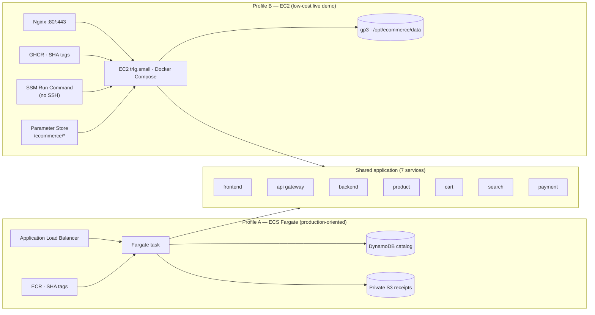

# E-Commerce Deployment Platform

A portfolio-ready e-commerce microservices demo with reproducible local development and two automated deployment paths to AWS: a production-oriented **ECS Fargate** profile and a cost-optimized **EC2 + Docker Compose** profile for a live demo. This repository is the maintained implementation that consolidates the original DEPI project plan and prototype into one working codebase.

## Order email notifications

Email delivery is disabled by default, and an unavailable SMTP server never prevents an order from being saved. To enable Gmail delivery, enable two-step verification on the sender Google account, generate a Gmail **App Password**, then put the sender in `SMTP_USER`, the App Password in `SMTP_PASS`, and a sender address in `EMAIL_FROM` in the ignored `.env`. Set `EMAIL_NOTIFICATIONS_ENABLED=true` and `ORDER_NOTIFICATION_EMAIL=mostafaanwar262004@gmail.com`, then recreate the payment container. Never commit or paste an App Password into chat.

## What is included

- Seven Node.js services: frontend, API gateway, backend, product, cart, search, and demo payment.
- Docker Compose with health checks, isolated networking, non-root containers, and Nginx routing.
- A production Compose stack (`docker-compose.prod.yml`) that publishes only Nginx on 80/443, persists orders and receipts to the host, and puts Prometheus/Grafana behind an optional `monitoring` profile.
- Automated tests for service health and core product, cart, search, order, and payment behavior — including API route-wiring and persistence-survival regression tests.
- Terraform for ECR, ECS Fargate, an Application Load Balancer, VPC networking, CloudWatch Logs, and autoscaling.
- A second, additive Terraform profile (`infrastructure/terraform/free-tier-ec2/`): one `t4g.small` behind Nginx, no NAT, no ALB, no RDS, least-privilege IAM and no SSH.
- A persistent DynamoDB product catalog on AWS, with an embedded catalog for zero-configuration local development.
- GitHub Actions CI/CD using short-lived AWS OIDC credentials—no permanent AWS access keys.
- ECR image scanning, immutable commit-SHA releases, build cache, SBOM/provenance, and deployment smoke tests.
- Multi-arch (`linux/amd64` + `linux/arm64`) images pushed to GHCR, deployed over AWS Systems Manager Run Command with automatic rollback.

> [!IMPORTANT]
> Vodafone Cash transfers are reviewed manually. A screenshot is not proof of payment: the owner must confirm the transfer in the actual Vodafone Cash account before marking an order as paid.

The project history, source-repository attribution, and team credits are recorded in [`docs/PROJECT_HISTORY.md`](docs/PROJECT_HISTORY.md). Current and future milestones are tracked in [`docs/ROADMAP.md`](docs/ROADMAP.md).

## Architecture

The AWS deployment uses one multi-container Fargate task to keep a demo environment reasonably small. Only the frontend port is reachable through the ALB. The remaining services communicate inside the task over localhost and are not publicly exposed. The product service reads the catalog from an encrypted DynamoDB table using a least-privilege ECS task role.

Both deployment profiles run the exact same seven services. Only the transport, ingress and state differ:



## Deployment profiles

|  | **Profile A — ECS Fargate** | **Profile B — EC2 (low-cost demo)** |
| --- | --- | --- |
| Purpose | Production-oriented showcase | Real AWS site at the lowest sensible cost |
| Compute | ECS Fargate tasks | One `t4g.small` (Graviton/ARM64) + Docker Compose |
| Ingress | Application Load Balancer + ACM + Route 53 | Nginx in a container, ports **80/443 only** |
| Networking | VPC, private subnets | One VPC, **one public subnet**, IGW — **no NAT** |
| State | DynamoDB catalog, private S3 receipts, remote Terraform state in S3 | JSON file + receipts on the EBS volume (single instance) |
| Secrets | AWS Secrets Manager (never in Terraform or `tfvars`) | SSM Parameter Store `/ecommerce/*` → `/opt/ecommerce/.env.production` (mode 600) |
| Images | ECR | GHCR `ghcr.io/<owner>/ecommerce-<service>:<SHA>` |
| Auth to AWS | GitHub OIDC | GitHub OIDC |
| Deployment | `ci-cd.yml` → `terraform apply` → ECS | `deploy-free-tier.yml` → **SSM Run Command** (no SSH) |
| Access | ALB URL | Instance IP/DNS; HTTPS is an optional second stage |
| Terraform | `infrastructure/terraform/` + `bootstrap/` | `infrastructure/terraform/free-tier-ec2/` |
| Rough cost | ALB + Fargate + data transfer — metered, not free | **$0 compute during the T4g free trial** (≤ 750 hrs/mo through Dec 31 2026); storage/network still billed. ≈ $17.25/month On-Demand from Jan 1, 2027 — see [cost doc](docs/AWS_FREE_TIER_DEPLOYMENT.md) |

Both profiles are **additive**: neither was removed or restructured to make room for the other. Full details, verification status and known limitations are in [`DEPLOYMENT_SUMMARY.md`](DEPLOYMENT_SUMMARY.md).

## Local development

Requirements: Node.js 20+, npm 10+, and Docker with Compose v2.

```bash
npm ci
npm test
docker compose up --build
```

Open `http://localhost:8080`. To use another local port:

```bash
HTTP_PORT=8088 docker compose up --build
```

Stop the environment with:

```bash
docker compose down --remove-orphans
```

## Manual Vodafone Cash payment

Copy `.env.example` to `.env` and configure the payment number plus the administrator settings. Never commit this file.

```bash
# Generate an scrypt password hash without printing it in CI logs.
node -e "const c=require('crypto'),s=c.randomBytes(16).toString('base64url');console.log('scrypt$'+s+'$'+c.scryptSync(process.argv[1],Buffer.from(s,'base64url'),64).toString('base64url'))" 'CHOOSE_A_STRONG_PASSWORD'
node -e "console.log(require('crypto').randomBytes(32).toString('base64url'))"
```

Set the first output as `ADMIN_PASSWORD_HASH` and the second as `ADMIN_SESSION_SECRET`. The local receipt volume is private to the payment container; it is not served by Nginx. Customers receive an order ID and a one-time tracking token, and must present both to check status or upload a receipt. The token is stored only as a SHA-256 hash.

When putting an scrypt hash in Docker Compose's `.env`, replace each `$` with `$$`; Compose passes `$$` through as a literal dollar sign. This avoids accidental environment-variable interpolation inside the hash.

The flow is: customer creates order → receives Vodafone Cash instructions → admin notification → customer transfers and uploads a receipt → owner checks the real transfer → owner approves or rejects → customer checks the final status. Receipt uploads only set `receipt_submitted`; they never set `paid`.

The owner dashboard API is under `/api/admin`; use `/admin` as the entry point. Authentication uses a password hash, HttpOnly SameSite=Strict session cookie, CSRF token, expiry, generic failures, and login rate limiting. For ECS, use AWS Secrets Manager to inject `ADMIN_USERNAME`, `ADMIN_PASSWORD_HASH`, `ADMIN_SESSION_SECRET`, and optional Telegram values. Do not set them as Terraform variables or task-definition plaintext.

For AWS receipts, configure a private encrypted S3 bucket with Block Public Access, lifecycle rules, and a payment-service-only IAM policy. The current local adapter is intended for Docker development; production should replace it with an S3 adapter that returns short-lived presigned URLs.

## First AWS deployment

> [!IMPORTANT]
> Production deployment requires a public DNS name hosted in Route 53 and an
> existing Secrets Manager JSON secret for the payment service. The workflow
> deliberately fails before provisioning if these references are absent.
> The secret must contain the names listed in `.env.example` that are used by
> payment/admin/email configuration; never place the values in Terraform,
> `tfvars`, GitHub variables, or source control. Receipt images are stored in
> the private, encrypted S3 receipt bucket created by Terraform.

Use an AWS account where you are allowed to create IAM, S3, VPC, ECR, ECS, CloudWatch, and load-balancer resources. The one-time bootstrap must be run by an authenticated AWS administrator from a trusted computer.

### 1. Authenticate locally

```bash
aws configure sso
aws sso login --profile YOUR_PROFILE
export AWS_PROFILE=YOUR_PROFILE
```

Confirm the target account before creating anything:

```bash
aws sts get-caller-identity
```

### 2. Bootstrap remote state and GitHub OIDC

```bash
cd infrastructure/terraform/bootstrap
terraform init
terraform plan -out=bootstrap.tfplan
terraform apply bootstrap.tfplan
terraform output
```

The bootstrap creates:

- A private, encrypted, versioned S3 Terraform-state bucket.
- One account-level GitHub OIDC provider, trusting only
  `mostafaahmed-eng/ecommerce-deploy` on the `main` branch with the audience
  `sts.amazonaws.com`.
- **Two separate deployment roles**, so neither workflow can be wired to the
  other profile's permissions:

  | Terraform resource | IAM role name | Output → Actions secret | Permissions |
  | --- | --- | --- | --- |
  | `aws_iam_role.legacy_ecs` | `<project>-github-actions-legacy` | `legacy_role_arn` → **`AWS_LEGACY_ROLE_ARN`** | AWS `PowerUserAccess` plus IAM restricted to `<project>-*` roles. Consumed only by the manual-only legacy ECS profile. |
  | `aws_iam_role.free_tier` | `<project>-github-actions-free-tier` | `free_tier_role_arn` → **`AWS_FREE_TIER_ROLE_ARN`** | `ssm:SendCommand` on `AWS-RunShellScript` for a single instance, plus `ssm:GetCommandInvocation`. |

`PowerUserAccess` is granted in exactly one place in this repository — the
legacy role — and `deploy-free-tier.yml` never references it. There is
deliberately no generic `github_actions_role_arn` output any more.

If the AWS account already contains the GitHub OIDC provider, do **not** create
a duplicate. Either reference it from `terraform.tfvars`:

```hcl
github_oidc_provider_arn = "arn:aws:iam::ACCOUNT_ID:oidc-provider/token.actions.githubusercontent.com"
```

…or import it into this configuration instead:

```bash
terraform import 'aws_iam_openid_connect_provider.github[0]' \
  arn:aws:iam::ACCOUNT_ID:oidc-provider/token.actions.githubusercontent.com
```

Use exactly one of the two approaches. Finally, set `free_tier_instance_id` to
the demo instance (the same value as the `AWS_INSTANCE_ID` Actions variable);
while it is left null the free-tier role is **fail-closed** and cannot send any
command.

> [!NOTE]
> Nothing in this section has been applied. The bootstrap is design-only until
> the AWS phase is explicitly opened.

### 3. Configure GitHub

In the repository settings, add these Actions secrets:

| Name | Value |
| --- | --- |
| `AWS_LEGACY_ROLE_ARN` | `legacy_role_arn` from bootstrap output — legacy ECS profile only |
| `TF_STATE_BUCKET` | `state_bucket_name` from bootstrap output |
| `PAYMENT_SECRETS_ARN` | ARN of the pre-created Secrets Manager JSON secret for payment/admin/email settings |

Optionally add the Actions variable `AWS_REGION`; it defaults to `us-east-1`.
Add the required Actions variables `PUBLIC_DOMAIN_NAME` (for example
`store.example.com`) and `ROUTE53_ZONE_ID` (the public hosted zone that owns
that name). Terraform requests and validates an ACM certificate, redirects
HTTP to HTTPS, and creates the DNS alias to the ALB.

Create a protected GitHub environment named `production` if deployment approval is required. Protect `main` and require the CI checks before merging.

### 4. Deploy

Push or merge to `main`. The workflow will:

1. Install dependencies, run tests, check Compose, and validate Terraform.
2. Provision ECR repositories on the first run.
3. Build and push all seven images tagged with the commit SHA.
4. plan and apply the AWS infrastructure.
5. Wait for ECS stability and smoke-test the public health endpoint.

The final ALB URL appears in the workflow summary and in the Terraform `application_url` output.

## Manual Terraform commands

For troubleshooting or a controlled manual deployment:

```bash
cd infrastructure/terraform
terraform init \
  -backend-config="bucket=YOUR_STATE_BUCKET" \
  -backend-config="key=ecommerce/production/terraform.tfstate" \
  -backend-config="region=us-east-1" \
  -backend-config="encrypt=true"
terraform fmt -check -recursive
terraform validate
terraform plan -var="image_tag=COMMIT_SHA"
```

Do not apply an image tag that has not already been pushed to every ECR repository.

## Rollback

Each deployment uses an immutable Git commit SHA. The safest rollback is to rerun the workflow for a known-good commit or revert the bad commit and merge the revert. ECS retains previous task-definition revisions for emergency manual rollback.

## Low-cost live demo (Profile B — EC2 + Docker Compose)

A second, independent profile that puts the whole stack on a single small VM.
Full rationale, cost tables and the pre-apply checklist live in
[`docs/AWS_FREE_TIER_DEPLOYMENT.md`](docs/AWS_FREE_TIER_DEPLOYMENT.md).

> [!IMPORTANT]
> At the time this deployment profile was prepared, AWS provides a **T4g free
> trial** covering up to **750 hours/month of `t4g.small`** usage through
> **December 31, 2026**, for new and existing AWS customers. Regular On-Demand
> billing starts **January 1, 2027**.

> [!CAUTION]
> **Nothing here guarantees a $0 bill.** Other resources, surplus CPU credits,
> network usage, storage, public IPv4 usage outside applicable allowances, and
> usage after the trial may incur charges. Eligibility and AWS terms can
> change — confirm the current offer before you rely on it. Enable the budget
> alert on the very first apply.

### Run the production stack locally first

```bash
docker compose -f docker-compose.prod.yml build
HTTP_PORT=18080 docker compose -f docker-compose.prod.yml up -d
./scripts/smoke-test.sh --base-url http://localhost:18080
docker compose -f docker-compose.prod.yml down          # data survives in ./data
```

The optional monitoring stack:

```bash
docker compose -f docker-compose.prod.yml --profile monitoring up -d
```

### 1. Provision the host

```bash
cd infrastructure/terraform/free-tier-ec2
terraform init -backend=false
terraform fmt -check -recursive
terraform validate
terraform plan \
  -var='create_budget=true' \
  -var='budget_email=you@example.com' \
  -var='budget_limit_usd=10'
# read the entire plan, then:
terraform apply
terraform output instance_id
```

Amazon Linux 2023, one VPC, one public subnet, an IGW, a security group that
allows **80/443 only**, IMDSv2 required, an encrypted 20 GB gp3 root volume, and
an instance role limited to `AmazonSSMManagedInstanceCore` plus read-only
`/ecommerce/*`. **No SSH key and no port 22.**

### 2. Store the secrets

```bash
scripts/aws/load-ssm-env.sh --list     # parameter NAMES only — never values
```

`scripts/aws/load-ssm-env.sh` reads `/ecommerce/*` (paginated, `--with-decryption`)
and renders `/opt/ecommerce/.env.production` with mode `600` using an atomic
rename. Secret values are never printed and the file is git-ignored. See the
*Parameter Store layout* section of the cost doc for the exact keys.

### 3. Configure GitHub

| Kind | Name | Required | Purpose |
| --- | --- | --- | --- |
| Secret | `AWS_FREE_TIER_ROLE_ARN` | yes | Least-privilege IAM role assumed through GitHub OIDC |
| Variable | `AWS_REGION` | yes | Region for `configure-aws-credentials` |
| Variable | `AWS_INSTANCE_ID` | yes | Target for SSM Run Command |
| Variable | `APP_URL` | recommended | Base URL for the post-deploy smoke test |
| Variable | `ENABLE_FREE_TIER_DEPLOY` | **required to deploy** | Must be exactly `true` to permit the SSM deploy job |

`ENABLE_FREE_TIER_DEPLOY` is the deployment gate. It is **not** configured yet,
so AWS deployment is currently disabled:

| Value | Effect |
| --- | --- |
| unset / `false` / anything except `true` | validation and image builds may run; the **AWS SSM deployment is skipped** |
| `true` | permits the free-tier SSM deploy job on `main` |

`TF_STATE_BUCKET` is **not** used by this workflow — the EC2 profile keeps
Terraform state local — but the ECS profile's remote-state support is untouched.
Use GHCR **public** packages so anyone can pull the demo images; if the packages
are private, the host needs `docker login ghcr.io` with a `read:packages` token.

### 4. Deploy

Deployment is **disabled by default**. Set the repository variable
`ENABLE_FREE_TIER_DEPLOY=true` (Settings → Secrets and variables → Actions →
Variables) to permit it; leave it unset or set it to `false` and the deploy job
stays skipped while validation and builds still run.

Merge to `main` (or run `workflow_dispatch` **from `main` only**). The workflow:

1. `validate` — tests, syntax checks, `terraform fmt`/`validate` for all three modules, Compose config, `nginx -t`. Runs on every PR and **never** deploys.
2. `build-pr` (pull requests only) — QEMU + Buildx over `linux/amd64,linux/arm64` with **`push: false`**. No GHCR login, no `packages: write` permission and no tag, so a PR can never publish an image or touch `:latest`.
3. `build-publish` (`main` only) — the same multi-arch build, but logs in to GHCR and pushes `ghcr.io/<owner>/ecommerce-<service>:<SHA>` **and** `latest`.
4. `deploy` — requires **all three**: `refs/heads/main`, an event that is not `pull_request`, and `ENABLE_FREE_TIER_DEPLOY == 'true'`. GitHub **OIDC** → AWS → `aws ssm send-command` running `/opt/ecommerce/compose/deploy.sh --sha <SHA>` → poll → public smoke tests.

Static AWS keys are never used. `id-token: write` is granted only to the deploy job.

The legacy ECS profile in `ci-cd.yml` is **manual only**. Its
`provision-registry`, `build` and `deploy` jobs require `workflow_dispatch`
**from `refs/heads/main`** *and* the boolean input `deploy_legacy_ecs = true`.
Validation still runs on every pull request and on every push to `main`, but a
normal merge can never provision ECR, push ECR images, run `terraform apply` or
deploy to ECS. The legacy ECS code is preserved for portfolio/reference use.

### 5. Operate without SSH

```bash
aws ssm start-session --target "$INSTANCE_ID" --region "$AWS_REGION"
aws ssm send-command --target "$INSTANCE_ID" \
  --document-name AWS-RunShellScript \
  --parameters 'commands=["docker ps"]'
```

On the host: `ecommerce-health`, `ec-status`, `ec-logs`, and

```text
/opt/ecommerce/.env.production     secrets, mode 600
/opt/ecommerce/data/               orders, sessions, notifications
/opt/ecommerce/uploads/receipts/   uploaded receipts (random names)
/opt/ecommerce/.deployment/current   active image SHA
/opt/ecommerce/.deployment/previous  last known-good SHA (rollback target)
```

### 6. Rollback

`deploy.sh` rotates `previous`/`current` **before** touching running containers,
then waits for health and runs `scripts/smoke-test.sh`. If the pull, the start,
the health wait or the smoke tests fail, it prints non-secret diagnostics
(`compose ps` + the last log lines with secrets redacted) and redeploys
`previous` automatically. The GitHub job still goes red.

Manual rollback:

```bash
bash /opt/ecommerce/compose/deploy.sh --rollback
```

### 7. Smoke tests

`scripts/smoke-test.sh` is credential-free (so nothing sensitive can reach a CI
log) and checks `/`, `/nginx-health`, `/api/health`, `/api/products`,
`/api/search`, `/api/categories`, `/api/cart/*`, `/api/payments/*`,
`/api/admin/*` and `/api/contact`. **400/401 are a PASS** — they prove the route
exists and is guarded. **404, 502 and 503 are always a FAIL.**

### 8. Optional: HTTPS

HTTP works immediately with no domain. When you have one:

```bash
scripts/aws/setup-https.sh example.com admin@example.com   # add --staging first if you like
```

It validates the arguments, warns if DNS does not point at the instance,
issues a Let's Encrypt certificate over HTTP-01, renders the TLS server block,
runs `nginx -t` and **only then** reloads — reverting to HTTP-only if the config
is rejected. A twice-daily renewal job reloads nginx only when the certificate
actually changed. The owner dashboard uses a `Secure` cookie, so admin login
becomes fully functional only after this step.

### 9. Teardown

```bash
cd infrastructure/terraform/free-tier-ec2
terraform plan -destroy
terraform destroy
```

This destroys `/opt/ecommerce/data` and `/opt/ecommerce/uploads/receipts` with
the instance — export anything you want to keep first.

## Required GitHub settings at a glance

| Profile | Workflow | Secrets | Variables |
| --- | --- | --- | --- |
| A — ECS | `ci-cd.yml` | `AWS_LEGACY_ROLE_ARN`, `TF_STATE_BUCKET`, `PAYMENT_SECRETS_ARN` | `AWS_REGION`, `PUBLIC_DOMAIN_NAME`, `ROUTE53_ZONE_ID` |
| B — EC2 | `deploy-free-tier.yml` | `AWS_FREE_TIER_ROLE_ARN` | `AWS_REGION`, `AWS_INSTANCE_ID`, `APP_URL`, `ENABLE_FREE_TIER_DEPLOY` |

Deployment gates:

- **Profile B — free-tier EC2.** The `deploy via SSM` job requires **all three**:
  `refs/heads/main`, an event that is not `pull_request`, and
  `ENABLE_FREE_TIER_DEPLOY == 'true'`.

  | `ENABLE_FREE_TIER_DEPLOY` | Effect |
  | --- | --- |
  | unset / `false` | validation and builds may run; **AWS SSM deployment is disabled** |
  | `true` | permits the free-tier SSM deploy job on `main` |

- **Profile A — legacy ECS.** `provision-registry`, `build` and `deploy` require
  **all three**: `workflow_dispatch`, `refs/heads/main`, and the boolean input
  `deploy_legacy_ecs = true`. A normal merge or push to `main` cannot run
  `terraform apply` or deploy ECS. The legacy ECS code stays in the repository
  for portfolio/reference purposes.
- **Role separation.** Profile A assumes only `AWS_LEGACY_ROLE_ARN` (broad, for
  the manual `terraform apply` path); Profile B assumes only
  `AWS_FREE_TIER_ROLE_ARN`, whose entire policy is `ssm:SendCommand` on
  `AWS-RunShellScript` for one instance plus `ssm:GetCommandInvocation`.
  Neither workflow references the other profile's secret, and `PowerUserAccess`
  exists on the legacy role alone.

Pull requests validate and build images with `push: false` — no GHCR login, no
`packages: write`, no `:latest`. GitHub OIDC is used by both profiles; no
long-lived AWS key exists in either workflow.

## Cost and cleanup

AWS resources incur charges, notably Fargate and the Application Load Balancer. This design avoids a NAT Gateway and an EKS control-plane fee, but it is not free.

**Profile B is the cheaper of the two.** During the current T4g free trial
(≤ 750 hours/month of `t4g.small` through **December 31, 2026**) its *compute*
is covered; storage, network and public IPv4 outside applicable allowances are
still billed, so expect a small nonzero amount rather than nothing. From
**January 1, 2027** the same instance bills On-Demand at roughly **$17.25/month**
running 24/7 in `us-east-1` (about $1.60 if you stop it). See
[`docs/AWS_FREE_TIER_DEPLOYMENT.md`](docs/AWS_FREE_TIER_DEPLOYMENT.md) for the
full breakdown of avoided cost traps, free-tier caveats, the pre-apply
checklist and budget-alert commands. **Neither profile guarantees a $0 bill.**

To remove the Profile A application infrastructure:

```bash
cd infrastructure/terraform
terraform destroy -var="allow_repository_force_delete=true"
```

Verify the exact account and plan before approving a destroy. Keep the bootstrap state bucket until the application state is no longer needed.

For Profile B the teardown is `cd infrastructure/terraform/free-tier-ec2 && terraform destroy`, and the optional budget (disabled by default) goes with it.

## Repository layout

```text
services/                      Node.js services and Dockerfiles
tests/                         Automated service tests (route wiring, persistence, storefront)
nginx/                         Production reverse proxy (HTTP + reusable snippets + TLS template)
docker-compose.yml             Development stack
docker-compose.prod.yml        Production stack (nginx-only ingress, monitoring profile)
scripts/smoke-test.sh          Credential-free post-deployment checks
scripts/aws/load-ssm-env.sh    SSM Parameter Store -> /opt/ecommerce/.env.production (600)
scripts/aws/deploy.sh          Host-side deploy, health wait, diagnostics, rollback
scripts/aws/setup-https.sh     Optional stage-two Let's Encrypt enablement
infrastructure/terraform/      AWS ECS infrastructure
infrastructure/terraform/bootstrap/  State bucket and GitHub OIDC
infrastructure/terraform/free-tier-ec2/  Low-cost single-VM profile
infrastructure/k8s/            Optional Kubernetes learning deployment
monitoring/                    Prometheus reference configuration
docs/                          Project history, roadmap and the AWS cost/safety guide
.github/workflows/             ci-cd.yml (ECS) and deploy-free-tier.yml (EC2)
DEPLOYMENT_SUMMARY.md          What changed, how it was verified, and its limits
```

## Repository history (preserved artifacts)

This branch was joined with `origin/main` using `git merge
--allow-unrelated-histories`, so the original prototype's history and the
current implementation now share one branch. The prototype's files are
preserved rather than deleted, even though nothing in the current system
invokes them:

| Path | What it is | Status today |
| --- | --- | --- |
| `Jenkinsfile` | Root Jenkins pipeline that pushes GHCR images | Not invoked by any current workflow |
| `ci-cd/jenkins/Jenkinsfile` | Earlier variant of the Jenkins pipeline | Archived reference |
| `ci-cd/github-actions/ci-cd.yml` | Earlier GHCR GitHub Actions workflow | Superseded by `.github/workflows/` |
| `infrastructure/ansible/playbooks/deploy.yml` | Ansible deployment playbook | Archived reference |
| `infrastructure/terraform/modules/vpc/` | VPC Terraform module | Not referenced by any of the three root modules |
| `infrastructure/terraform/modules/eks/` | EKS Terraform module | Not referenced by any of the three root modules |
| `services/web/` | Prototype static site served by `serve` | Superseded by `services/frontend` |

The live configuration is the one documented above: `.github/workflows/` holds
the two active pipelines, `infrastructure/terraform/` holds the three
validated root modules, and `services/` holds the seven application services.
See [`docs/PROJECT_HISTORY.md`](docs/PROJECT_HISTORY.md) for source
attribution and the consolidation decisions behind this split.

## Further reading

- [`DEPLOYMENT_SUMMARY.md`](DEPLOYMENT_SUMMARY.md) — 22-section summary of the low-cost profile, including what was verified locally versus what still needs AWS, DNS or GitHub configuration.
- [`docs/AWS_FREE_TIER_DEPLOYMENT.md`](docs/AWS_FREE_TIER_DEPLOYMENT.md) — resources created, honest cost estimates, free-tier caveats, pre-apply checklist, budget alerts, Parameter Store layout and teardown.
- [`docs/PROJECT_HISTORY.md`](docs/PROJECT_HISTORY.md) and [`docs/ROADMAP.md`](docs/ROADMAP.md) — source attribution and milestones.
